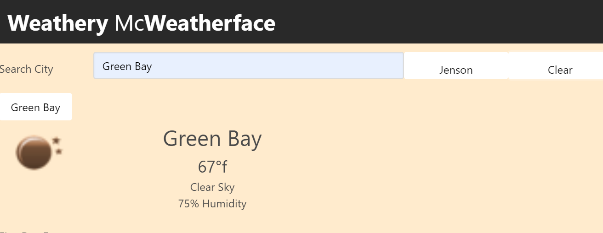

#  Weather Forecast App

## Description

Hello and thank you for viewing my Weather Forecast App! The working site can be viewed here: https://wrxjasonsti.github.io/weatherDashboard/

The criteria provided for this activity was to integrate the third-party API OpenWeather. Using jQuery AJAX functionality, as well as some previous key topics, like JSON.stringify and jQuery Append, it is mostly about getting a handle on the OpenWeather response to the get request. The key to a successful app is the mastery of the API's documentation.

© 2020
